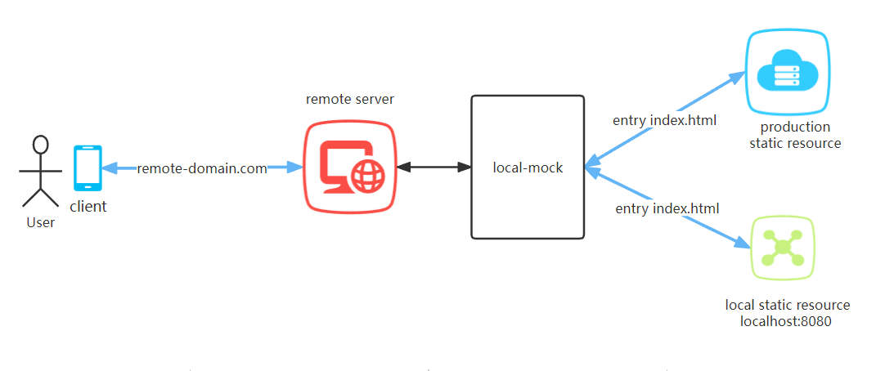
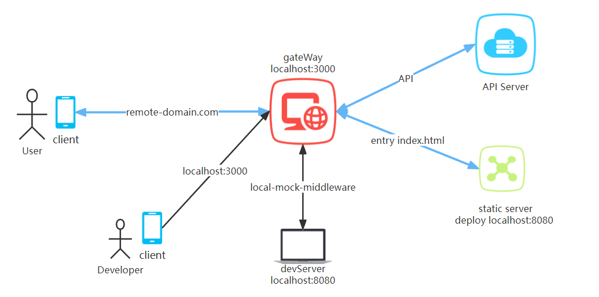

[English](./README.md) | 简体中文

# LocalMock 介绍

## What is LocalMock ?

LocalMock 顾名思义，指的是本地 mock 开发环境，在业务环境域名下将请求页面的资源，直接打到本地的开发服务器，它是一个可靠的本地开发调试的技术方案。

👍 同一个正式环境的 url，可根据需要访问本地静态资源



## 开发 H5 页面时存在的痛点

在业务开发中我们经常会遇到在业务域名下，本地开发调试页面不方便的问题，这是开发过程中普遍存在的痛点，试想下述业务开发场景。我们需要开发一个 H5 页面，能够在某些 APP 环境下完成 Auth2.0 授权后通过 webview 打开，外网的业务域名为 `remote-domain.com`，在常规开发流程下，那我们一般会做以下几件事情

1. 启动本地前端页面开发服务器 `devServer` 如 `localhost:8080`
1. 如果有网关层处理 Auth2.0 授权、接口转发、静态资源转发，那大概率还需要本地启动 node 网关层，如 `localhost:3000`
1. 通过代理将业务域名指向到本地，如：Charles Map Remote `remote-domain.com` -> `localhost:3000`
1. 访问 `remote-domain.com` 后，经过 Charles 代理、网关层转发、`devServer` 最终在 APP 端的 webview 展示页面

> 😫 呜呼~，完成以上步骤之后，终于可以开始愉快的开发 H5 页面了，但是这样的开发和调试步骤真的愉快吗 🤔？？？



## LocalMock 解决了什么问题？

LocalMock 旨在解决上述开发过程中遇到的痛点，相比一般的本地开发方式，它主要有以下优势：

- 🎉**无代理**，不需要将业务域名代理到本地（如：Charles Map Remote）
- 🚀**仅 devServer**，不需要同时启动 node 层服务
- 🌻**一键开启，调试方便**，通过 localMock 插件，一键即可在真机上开启调试
- ✌️**支持静态和网关两种场景**，支持 node 网关代理**转发静态资源**和外网域名**指向本地静态资源**两种模式

## LocalMock 快速上手

### 一. node 网关代理转发静态资源模式

本模式适用于有网关层处理 Auth2.0 授权、接口转发、静态资源转发的情况，通常在拿到授权信息之后将授权信息注入到入口文件 html 中。该方案需要同时在 nodejs 服务端安装 [local-mock-middleware](https://www.npmjs.com/package/local-mock-middleware)用于将远程 html 文件流替换成本地 `devServer` 的入口文件，在 H5 静态资源端安装 [local-mock-easy](https://www.npmjs.com/package/local-mock-easy)作为调试面板的插件方便使用。

具体使用的 example 请参考 [staticAndGateWay](./example/staticAndGateWay/README_CN.md)

#### 1. nodejs 端安装 local-mock-middleware 中间件

已经内置了 express 和 koa 两种使用方案，并且支持自定义扩展其他 node 服务

```js
// 以express为例
const express = require('express')
const createLockMock = require('local-mock-middleware')

// 创建 localMock 实例
const localMock = createLockMock({
  isLocalMockProxyOpen: process.env.NODE_ENV === 'dev', // 仅在dev环境启动
})

const app = express()
// 开启静态资源转发
localMock.createExpressLocalHtmlProxy(app)

app.use(middleware) // 其他中间件

const client = app.listen(3000, function () {
  // 可选操作，动态更新 port
  localMock.updateExpressPort(client)
  console.log('koa start sucessfully  ...')
})
```

> 更多使用，请参考 [local-mock-middleware](https://www.npmjs.com/package/local-mock-middleware)

#### 2. H5 前端安装 local-mock-easy 面板插件

已经内置了 vconsole 和 eruda 两种调试面板，并且支持自定义扩展其他调试服务

```js
// #!if ENV === "development"
import eruda from 'eruda'
import { erudaLocalMock } from 'local-mock-easy'

eruda.init()

const localMockplugin = erudaLocalMock(eruda, {})

eruda.add(localMockplugin)
// #!endif
```

> 更多使用，请参考 [local-mock-easy](https://www.npmjs.com/package/local-mock-easy)

### 二、 静态资源模式

本模式适用于无需网关层的业务页面通过替换静态资源入口实现调试。如：将业务页面 `remote-domain.com/pages/a` 内容替换成本地 `devServer` 的页面 `localhost:8080/pages/a`

具体使用的 example 请参考 [static](./example/static/README_CN.md)

#### 1. H5 前端安装 local-mock-easy 面板插件

已经内置了 vconsole 和 eruda 两种调试面板，并且支持自定义扩展其他调试服务

```js
// #!if ENV === "development"
import eruda from 'eruda'
import { erudaLocalMock } from 'local-mock-easy'

eruda.init()

const localMockplugin = erudaLocalMock(eruda, {
  mode: 'static',
})

eruda.add(localMockplugin)
// #!endif
```

> 更多使用，请参考 [local-mock-easy](https://www.npmjs.com/package/local-mock-easy)
