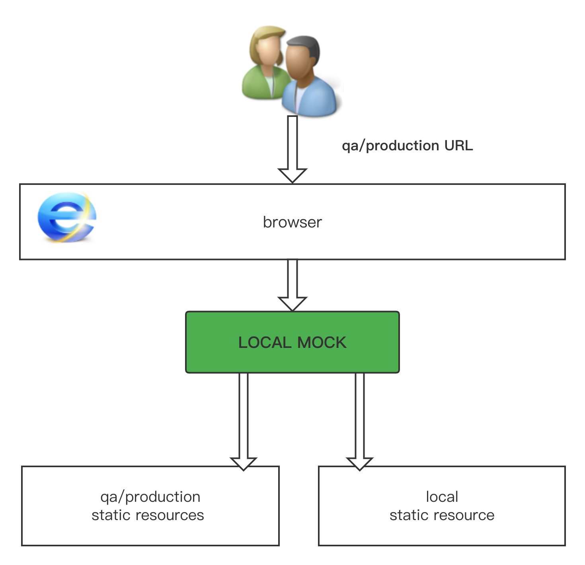

[English](./README.md) | 简体中文

# LocalMock 介绍

## What is LocalMock ?
LocalMock 顾名思义，指的是本地 mock 开发环境，在业务环境域名下将请求页面的资源，直接打到本地的开发服务器，它是一个可靠的本地开发调试的技术方案。

👍 同一个正式环境的url，可根据需要访问本地静态资源




相比一般的本地开发方式，它主要有以下优势：

- 🎉**无代理**，不需要将业务域名代理到本地（如：Charles Map Remote）
- 🚀**仅 devServer**，不需要同时启动 node 层服务
- 🌻**一键开启，调试方便**，通过 localMock 插件，一键即可在真机上开启调试


👊 支持两种场景
 1. node代理转发静态资源模式
 2. 对外域名直接指向静态资源


## 一. node代理转发静态资源模式


该方案需要同时在 nodejs 服务端安装 [local-mock-middleware](https://www.npmjs.com/package/local-mock-middleware)，在H5静态资源端安装 [local-mock-easy](https://www.npmjs.com/package/local-mock-easy)

example 代码见 [staticAndGateWay](./example/staticAndGateWay/gateWay/README_CN.md) 

### 第一步 nodejs 端安装 local-mock-middleware 中间件

已经内置了express 和 koa 两种使用方案，并且支持自定义扩展其他node服务


```js
// 以express为例
const express = require('express')
const createLockMock = require('local-mock-middleware')

const localMock = createLockMock({
  isLocalMockProxyOpen: process.env.NODE_ENV === 'dev', // 仅在dev环境启动
})
const app = express()

localMock.createExpressLocalHtmlProxy(app) 

app.use(middleware) // 其他中间件

const client =  app.listen(3000, function () {
  localMock.updateExpressPort(client) // 更新port
  console.log('koa start sucessfully  ...')
})

```

> 更多使用，请参考 [local-mock-middleware](https://www.npmjs.com/package/local-mock-middleware)

### 第二步 H5 端安装 local-mock-easy 面板插件

已经内置了 vconsole 和 eruda 两种调试面板，并且支持自定义扩展其他调试服务

```js
// #!if ENV === "development"
import eruda from 'eruda'
import { erudaLocalMock } from 'local-mock-easy'

eruda.init()

const localMockplugin = erudaLocalMock(eruda, {})

eruda.add(localMockplugin)
// #!endif
```

> 更多使用，请参考 [local-mock-easy](https://www.npmjs.com/package/local-mock-easy)


## 二、 静态资源模式